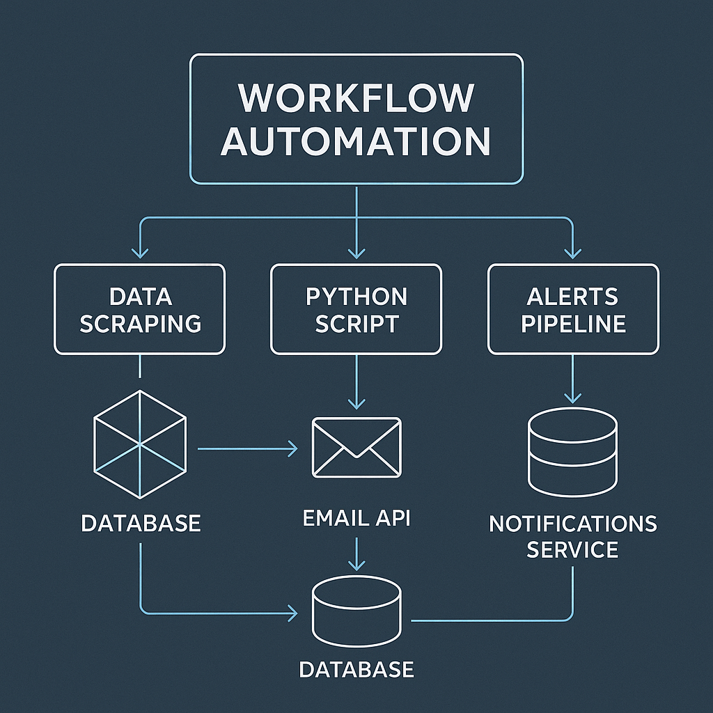
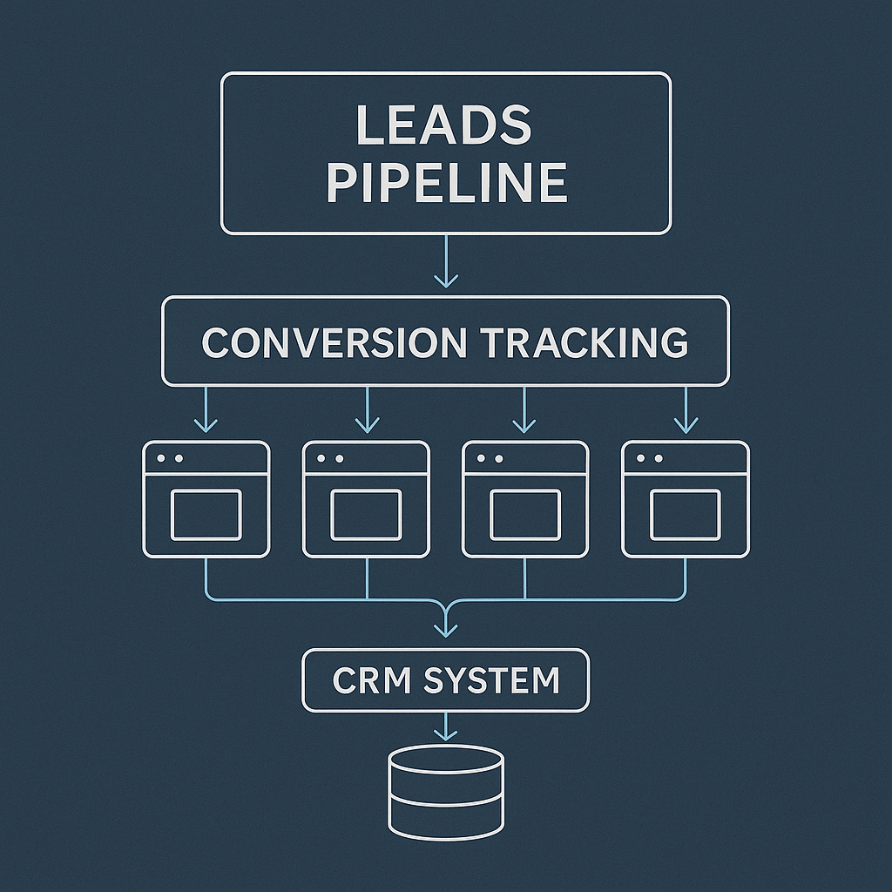
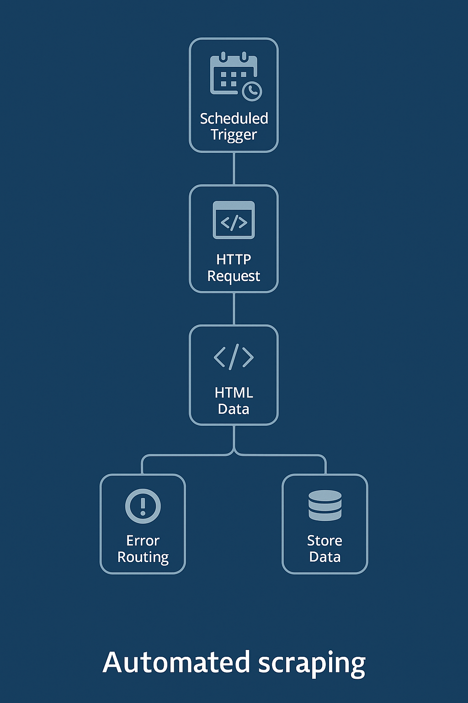
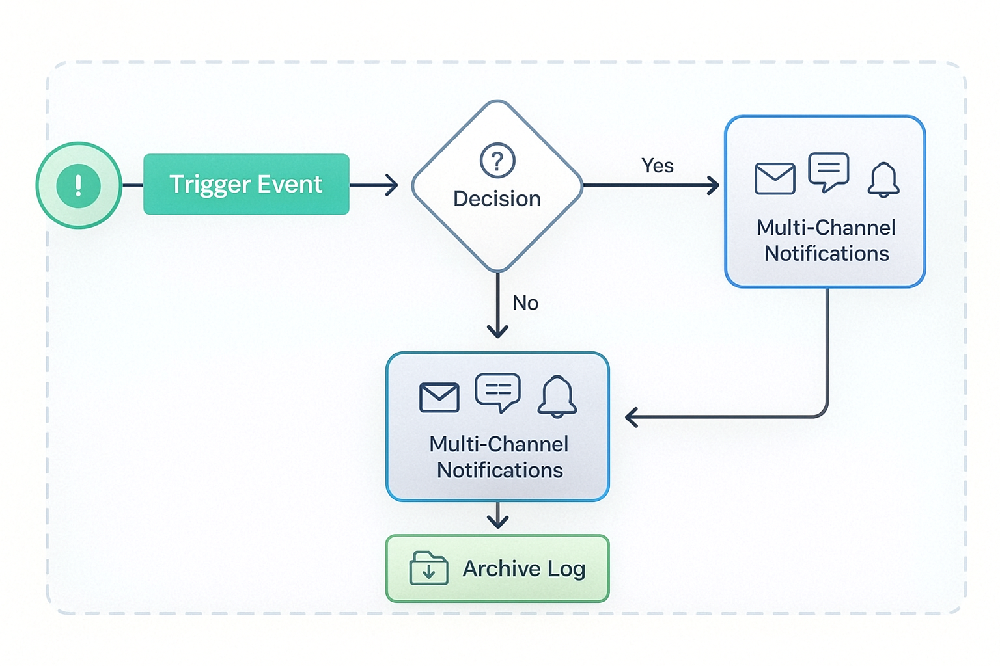

# ⚡ SIAG Software — Advanced n8n Workflows

This repository contains a curated set of **production-ready n8n workflows**, built as real examples of how SIAG Software designs automation pipelines for modern businesses.

These workflows demonstrate clean structure, reusable logic, and clear patterns for integrating APIs, scrapers, CRMs, notification systems, and Python helpers.

---

## 🚀 Features

- Ready-to-import **n8n workflows** (`.json`)
- Clean architecture diagrams
- API consumption + Google Sheets pipelines
- Web scraping → processing → export flows
- Notification workflows (email / webhook)
- Python helper script for custom logic
- Professional folder structure

---

## 📁 Repository Structure

```
n8n-workflows-advanced/
│
├── workflows/
│   ├── lead_pipeline.json
│   ├── scraping_pipeline.json
│   └── notifications_pipeline.json
│
├── scripts/
│   └── python_helper.py
│
├── docs/
│   ├── architecture.png
│   ├── diagram_leads.png
│   ├── diagram_scraping.png
│   └── diagram_notifications.png
│
├── README.md
└── LICENSE
```

---

## 🧠 Architecture Overview

A high-level view of how all workflow components interact:



---

## 📨 Lead Pipeline Workflow

Automates a full lead lifecycle:
- Capture / fetch leads  
- Normalize data  
- Store in Google Sheets or any CRM  
- Trigger notifications  



Workflow file:  
👉 `workflows/lead_pipeline.json`

---

## 🕸️ Scraping Pipeline Workflow

End-to-end automated scraping system:
- Fetch data from dynamic or static pages  
- Process + transform data  
- Store or deliver results  



Workflow file:  
👉 `workflows/scraping_pipeline.json`

---

## 🔔 Notification System Workflow

Reusable notification engine:
- Multi-channel (email, webhook, messaging)  
- Adjustable triggers  
- Built for extensibility  



Workflow file:  
👉 `workflows/notifications_pipeline.json`

---

## 🛠️ Python Helper

A small utility script for use inside n8n via the **Execute Command** or **HTTP Request** node.

Located in:  
`/scripts/python_helper.py`

---

## 📦 Importing Workflows into n8n

1. Open your n8n instance  
2. Go to **Settings → Import**  
3. Select any `.json` workflow  
4. Save and activate  
5. Customize nodes (API keys, URLs, credentials)

All workflows are modular and editable.

---

## 📄 License — MIT

This repository is distributed under the **MIT License**.

Commercial use allowed.  
Attribution to SIAG Software appreciated.

---

## 🌐 About SIAG Software

We build:
- AI chatbots  
- Workflow automation  
- Full-stack web systems  
- Advanced scrapers  
- Business intelligence tools  

**Contact:** siag.software@protonmail.com  
Website coming soon.

